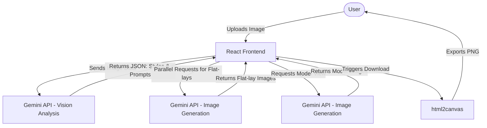

# StyleSync: The Future of Fashion

StyleSync is an AI-powered personal styling studio that transforms how you choose your outfits.

## 🎯 The Problem We Solve
Choosing the right outfit for different occasions can be time-consuming, overwhelming, and uninspired. Many people struggle to visualize how a single piece of clothing can be styled for various contexts (like casual wear, professional settings, or a night out). StyleSync solves this by acting as your personal AI stylist. It analyzes any uploaded clothing item or portrait and instantly generates complete, curated outfit recommendations, complete with high-quality visual representations (both flat-lays and model views).

## 🚀 How It Works
1. **Upload:** You upload a portrait or a picture of a clothing item.
2. **AI Analysis:** The app sends the image to the Google Gemini API, which analyzes the clothing's silhouette, style, and texture.
3. **Outfit Generation:** Gemini returns three distinct, curated outfit contexts: Casual Wear, Professional Outfit, and Night Out.
4. **Visual Composition:** The app automatically generates high-quality flat-lay images for each outfit recommendation using Gemini's image generation capabilities.
5. **Editorial Transformation:** You can optionally request an "Editorial Model View" to see how the outfit looks on a human model.
6. **Save & Share:** You can download the generated looks directly to your device or share them with friends.

## 🏗️ Architecture Flow



## 💻 Tech Stack
- **Frontend Framework:** React 19, TypeScript, Vite
- **Styling:** Tailwind CSS 4, Motion (Framer Motion)
- **Icons:** Lucide React
- **AI Integration:** Google Gemini API (`@google/genai`) for vision analysis and image generation
- **Utilities:** `html2canvas` for screenshot and download functionality

## 🛠️ Run Locally

**Prerequisites:** Node.js

1. Clone the repository:
   ```bash
   git clone https://github.com/Arvindtechicon/StyleSync.git
   cd StyleSync
   ```

2. Install dependencies:
   ```bash
   npm install
   ```

3. Configure Environment Variables:
   Set the `GEMINI_API_KEY` in your `.env` or `.env.local` file to your Gemini API key:
   ```env
   GEMINI_API_KEY="your_api_key_here"
   ```

4. Run the development server:
   ```bash
   npm run dev
   ```

---
Built with ❤️ by Aravind S Gudi
