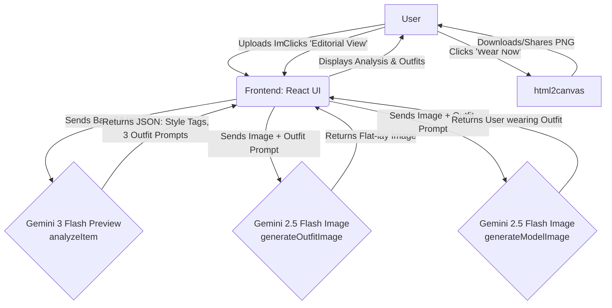

# StyleSync (VogueAI Stylist)

StyleSync (VogueAI Stylist) is an AI-powered Personal Shopper application. It takes a photo of a user and acts as a virtual stylist, analyzing their current style, body type, and features to recommend complete outfits. 

## 🌟 Key Functionalities

1. **Full Appearance & Style Analysis**: 
   - Users can upload a photo of themselves.
   - The application analyzes body type, silhouette, facial features, skin tone, and the current outfit's style and color palette.
2. **AI-Curated Outfit Recommendations**: 
   - Suggests three distinct outfit types: **Casual (Weekend Flow)**, **Business (Professional Pulse)**, and **Night Out (Rooftop Soirée)**.
   - Automatically selects a color palette that is significantly different from the user's current outfit, providing a fresh visual change while complementing their natural features.
3. **Virtual Try-On & Visualizations**:
   - **Flat-lay Generation**: Automatically generates a professional fashion flat-lay image of the curated outfit pieces.
   - **Editorial View (Model View)**: Generates a high-end fashion editorial full-body photo showing the user *wearing* the curated outfit. It strictly maintains the exact facial features and skin tone of the uploaded user.
4. **Export & Share**: 
   - Users can download a snapshot of their generated look ("Wear Now" feature) and instantly share it.

## 🏗 Architecture Flow

The application flow leverages React for the frontend and the `@google/genai` SDK to interface with Gemini models.



## 🛠️ Tech Stack

- **Frontend**: React 19, Vite, TypeScript
- **Styling**: Tailwind CSS v4, Motion (Framer Motion) for animations, Lucide React for icons
- **AI Integration**: `@google/genai` (Gemini 3 Flash Preview & Gemini 2.5 Flash Image)
- **Utilities**: `html2canvas` for screenshot and export

## 🚀 Run Locally

**Prerequisites:**  Node.js

1. Clone the repository and navigate into the project directory:
   ```bash
   git clone https://github.com/Arvindtechicon/StyleSync.git
   cd StyleSync
   ```

2. Install dependencies:
   ```bash
   npm install
   ```

3. Configure Environment Variables:
   Create a `.env.local` or `.env` file in the root directory and set your Gemini API key:
   ```env
   GEMINI_API_KEY="your_api_key_here"
   ```

4. Run the development server:
   ```bash
   npm run dev
   ```

5. View the app at `http://localhost:3000`.
